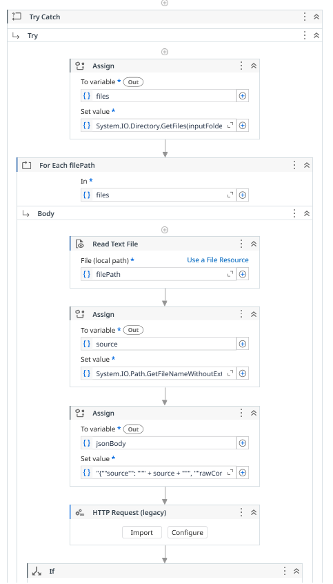
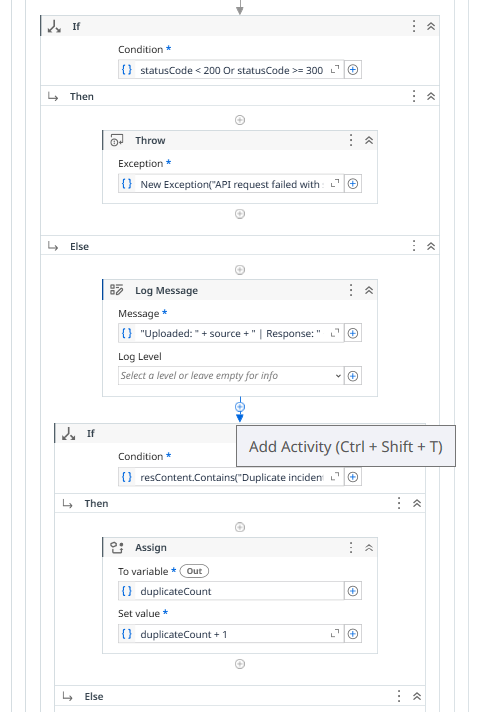
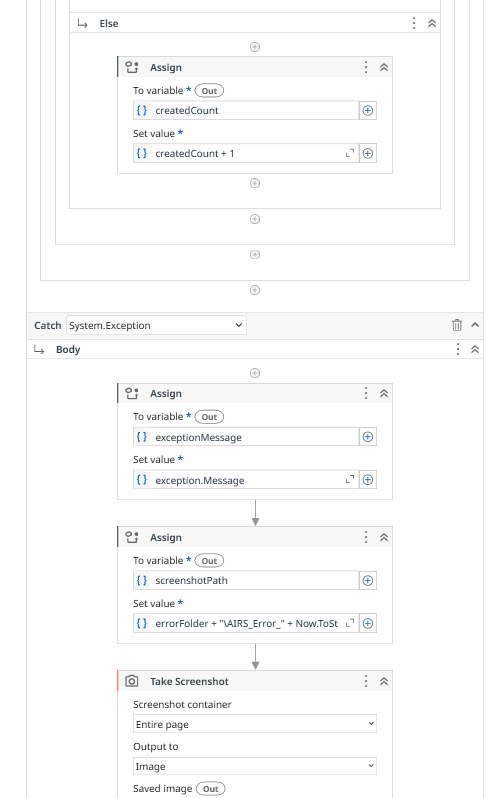
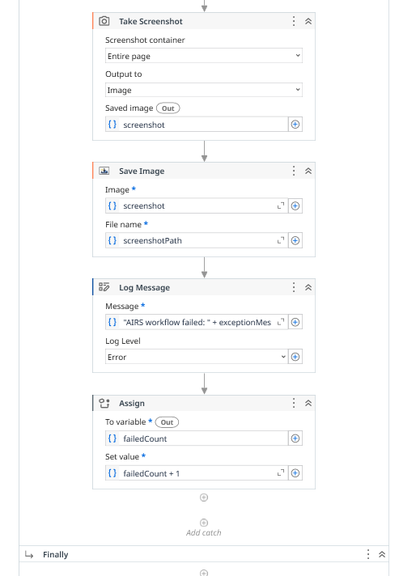
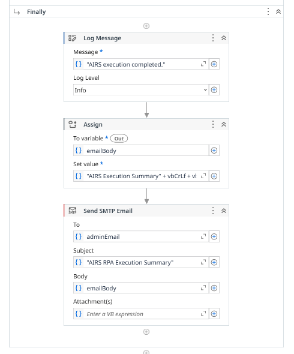

[](https://github.com/ChuanKai1410/AI-Driven-Incident-Reporting-System-AIRS-/actions/workflows/ci.yml)

# 📦 AI-Driven Incident Reporting System (AIRS)
### DHL Digital Automation Challenge - Scenario 2

---

## 📖 Overview

AIRS (AI-Driven Incident Reporting System) is an intelligent automation platform developed to address DHL’s operational challenge of handling fragmented and unstructured incident reports across multiple communication channels.

Customer support and operations teams often receive incident information from inconsistent sources such as:

- Emails
- WhatsApp messages
- Call center notes
- Warehouse handwritten instructions
- Internal operational communications

These reports are frequently incomplete, duplicated and difficult to track, leading to:

- Slow response times
- Incorrect incident routing
- Duplicate ticket creation
- Poor operational visibility
- Inconsistent customer service quality

AIRS solves this problem by integrating:

- 🤖 Robotic Process Automation (UiPath)
- 🧠 Artificial Intelligence (Google Gemini)
- 🌐 MERN Stack Web Dashboard
- 🔍 Semantic Similarity Analysis using Embeddings

The system transforms messy operational data into structured, actionable and trackable incident intelligence.

---

## 🎯 Key Objectives

- Automate ingestion of unstructured operational reports
- Extract actionable incident intelligence using AI
- Classify incidents by category, priority and department
- Detect duplicate incidents using semantic similarity
- Consolidate repeated reports into unified cases
- Visualize operational trends through AI clustering
- Provide a centralized workflow management dashboard

---

## 🏗️ System Architecture


AIRS follows a multi-layer intelligent system architecture that combines Robotic Process Automation (RPA), Artificial Intelligence (AI), semantic similarity analysis and a MERN-based operational dashboard into a centralized operational intelligence platform.

The system is designed to automate the full lifecycle of incident reporting, classification, duplicate detection, operational tracking and workflow management.

---

### 1️⃣ Incident Source Layer

Operational reports originate from multiple fragmented communication channels including:

- Customer Emails
- WhatsApp Complaints
- Support Call Logs
- Internal Operational Messages
- Warehouse Handwritten Notes
- Uploaded TXT / PDF / DOCX Files

These reports are often inconsistent and unstructured, requiring automated consolidation and processing.

---

### 2️⃣ RPA Automation Layer (UiPath)

The UiPath automation workflow handles intelligent incident intake and workflow automation.

Functions include:

- Read operational incident files
- Extract raw operational content
- Validate JSON payload structure
- API authentication verification
- Error handling and retry logic
- Screenshot capture during failures
- Execution logging and processing summaries
- Send structured incident payloads to backend API

This layer automates the operational incident collection process without manual intervention.

---

### 3️⃣ AI Intelligence & Backend Layer

#### 🔹 Backend API (Node.js + Express.js)

The backend server acts as the central communication bridge between the RPA workflow, Gemini AI and MongoDB database.

Core functions:

- Incident CRUD operations
- JWT authentication and authorization
- Upload processing
- Workflow status management
- RPA API validation
- Dashboard integration

---

#### 🔹 AI Intelligence Engine (Google Gemini AI)

Google Gemini AI is integrated to transform fragmented operational reports into structured operational intelligence.

AI capabilities include:

- AI summarization
- Point-form operational briefings
- Intelligent classification
- Priority detection
- Department recommendation
- Incident title generation
- Operational reasoning generation

---

#### 🔹 Semantic Intelligence Engine

AIRS uses Gemini embeddings and cosine similarity analysis to identify operational similarities beyond traditional keyword matching.

Functions include:

- Duplicate incident detection
- Semantic similarity comparison
- Automatic duplicate consolidation
- Related report merging
- Operational clustering
- Pattern recognition analysis

---

#### 🔹 Database Layer (MongoDB Atlas)

MongoDB Atlas stores all centralized operational intelligence data including:

- Incident records
- Related merged reports
- Embedding vectors
- Workflow statuses
- User authentication data
- Operational metadata

---

### 4️⃣ Management & Visualization Layer

The frontend dashboard is developed using React.js and Tailwind CSS.

Features include:

- JWT-secured login system
- Incident dashboard overview
- Incident list management
- Incident detail visualization
- Workflow status tracking
- Semantic cluster visualization
- Related reports timeline
- Upload console
- Search and filtering
- Operational risk indicators

The dashboard provides centralized operational visibility for DHL support teams.

---

## 🔄 System End-to-End Workflow Summary

The AIRS operational workflow is executed as follows:

1. Operational reports are collected from multiple communication channels
2. UiPath RPA extracts and validates incident content
3. Structured JSON payloads are sent to the backend API
4. Google Gemini AI analyzes and summarizes operational reports
5. Embeddings are generated for semantic similarity analysis
6. Cosine similarity detects semantically related incidents
7. Duplicate incidents are automatically consolidated
8. MongoDB stores centralized operational intelligence
9. React dashboard visualizes incidents, clusters and workflow statuses

This architecture enables AIRS to transform fragmented operational reports into centralized AI-powered operational intelligence.

---

## 🤖 AI Features

### 🧠 AI Incident Briefing
Messy operational reports are transformed into concise point-form operational summaries.

Example:

- Parcel delivered to outdated address
- Address update request was not applied
- Customer claims parcel missing
- Escalation required for operations team


### 🔍 Semantic Similarity Detection

Instead of relying on keyword matching, AIRS uses embeddings and cosine similarity to understand the semantic meaning of incidents.

This enables the system to identify:

- Duplicate operational cases
- Similar customer complaints
- Related warehouse incidents
- Operational failure patterns


### 🔗 Automatic Duplicate Consolidation
Repeated reports are automatically merged into a single operational incident.

```bash
Before:
COD Complaint
COD Complaint
COD Complaint

After:
COD Complaint
└── Related Reports (3)
```


### 📊 AI Operational Clustering
Incidents are grouped using embedding similarity to identify operational trends and recurring issue patterns.

Example:

- Address-related operational failures
- Repeated warehouse handling issues
- Recurring COD disputes

### 📥 AI Incident Intake Console
Supports TXT, PDF and DOCX upload for AI-powered incident extraction.

### 🧾 RPA Execution Logging
Includes status checks, error handling, screenshots on failure and execution summary logs.

### 👤 Creator Tracking 
Tracks whether an incident was created by a logged-in user or the RPA bot.

---

## 📸 Screenshots

### Dashboard


### Incident List


### Incident Details


### UiPath Workflow






---

## ⚙️ Tech Stack

| Layer | Technology |
|---|---|
| Frontend | React.js |
| Backend | Node.js + Express.js |
| Database | MongoDB Atlas |
| AI Engine | Google Gemini API |
| Embeddings | Gemini Embedding Model |
| RPA | UiPath Studio |
| Authentication | JWT |
| CI/CD | GitHub Actions | 

---

## 🛠️ Setup & Installation

### 1. Clone Repository

```bash
git clone https://github.com/your-username/AI-Driven-Incident-Reporting-System-AIRS-.git
cd AI-Driven-Incident-Reporting-System-AIRS-
```

```bash
git clone https://github.com/your-username/AI-Driven-Incident-Reporting-System-AIRS-.git
cd AI-Driven-Incident-Reporting-System-AIRS-
```

### 2\. Backend & Frontend Setup

Open two terminal windows:

**Terminal 1 (Server):**

```bash
cd server
npm install
node server.js
```

*Create server/.env*
```env
MONGO_URI=your_mongo_uri
GEMINI_API_KEY=your_gemini_api_key
PORT=5000
JWT_SECRET=your_jwt_secret
RPA_API_KEY=your_rpa_api_key
```

**Terminal 2 (Client):**

```bash
cd client
npm install
npm start
```

### 3\. Automation Workflow (UiPath)

To link the RPA collector to the web dashboard:

1.  Open the `rpa-uipath` folder in **UiPath Studio**.
2.  Open `Main.xaml`.
3.  Locate the **HTTP Request** activity and ensure the `Request URL` is set to `http://localhost:5000/api/incidents`.
4.  Add the RPA API key in the HTTP Request header:

```txt
x-api-key: your_rpa_api_key
```
5.  Run the bot to simulate real-world incident ingestion.

---

## 📂 Project Structure
```bash
client/         → React frontend dashboard
server/         → Express backend + AI engine
rpa-uipath/     → UiPath automation workflows
images/         → Architecture diagrams + System screenshots
```

---

## 🚀 Future Improvements
- Real email integration (Outlook/Gmail APIs)
- Google Drive ingestion
- Real-time operational analytics
- Advanced vector database integration
- AI recommendation engine
- Interactive embedding visualization
- Predictive operational risk analysis

---

## 🧑‍💻 Author

**Chew Chuan Kai** - *Software Engineering, Universiti Teknologi Malaysia (UTM)*

