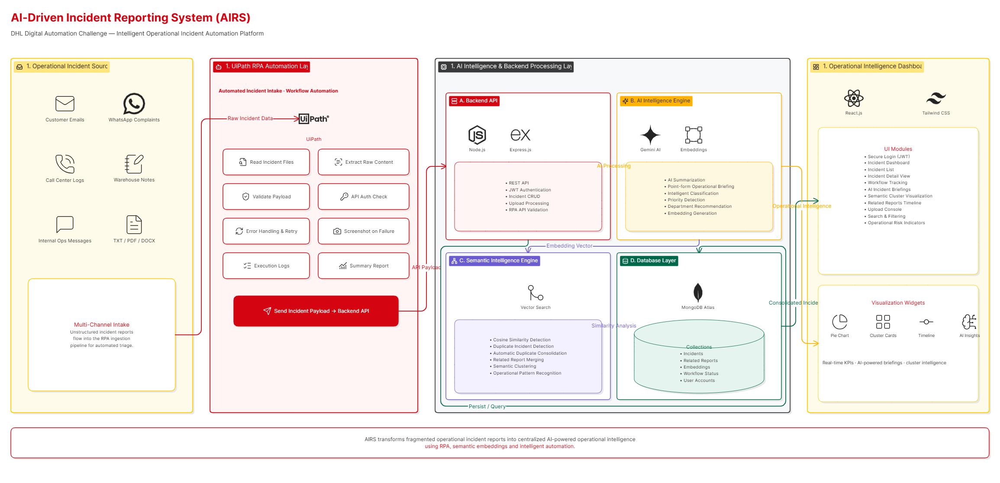
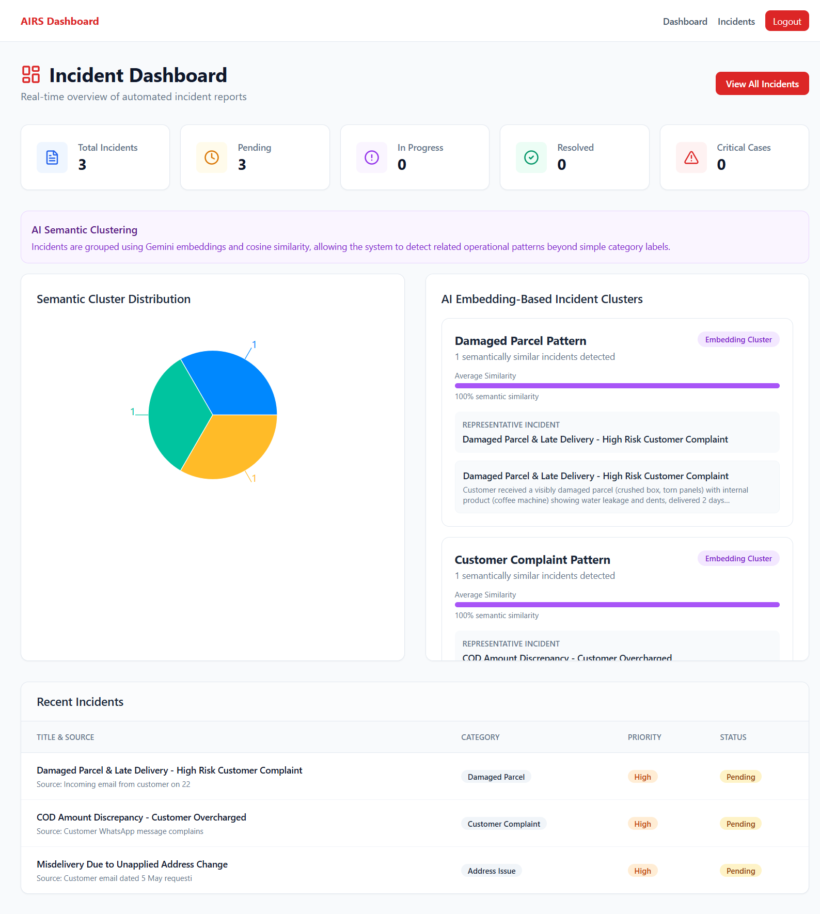
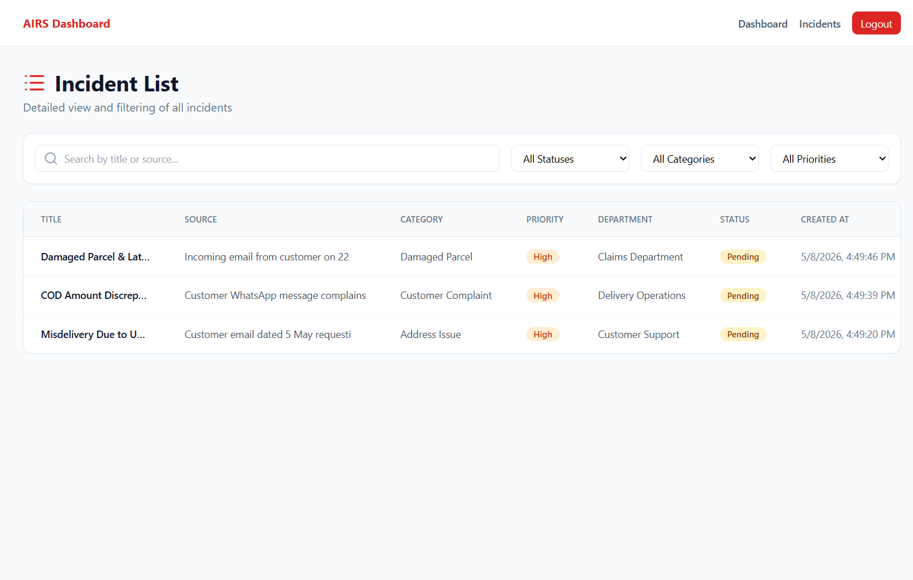
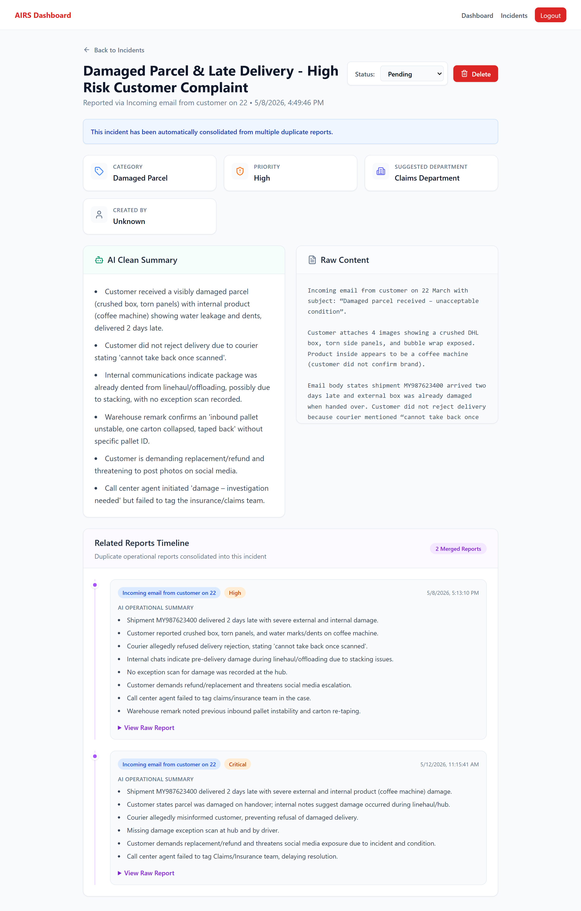
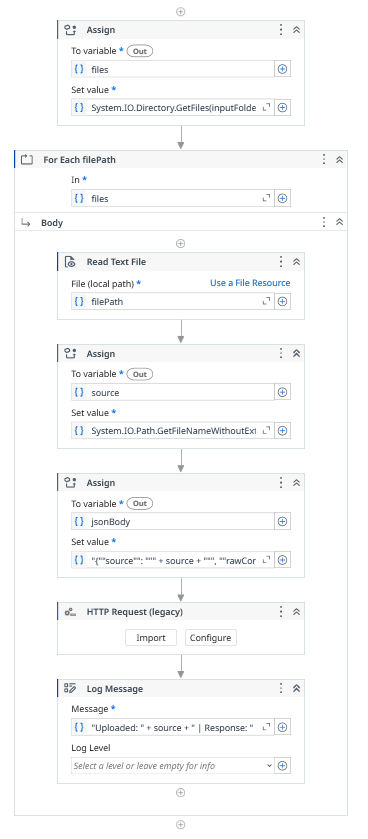

[](https://github.com/ChuanKai1410/AI-Driven-Incident-Reporting-System-AIRS-/actions/workflows/ci.yml)

# 📦 AI-Driven Incident Reporting System (AIRS)
### DHL Digital Automation Challenge - Scenario 2

---

## 📖 Overview

AIRS (AI-Driven Incident Reporting System) is an intelligent automation platform developed to address DHL’s operational challenge of handling fragmented and unstructured incident reports across multiple communication channels.

Customer support and operations teams often receive incident information from inconsistent sources such as:

- Emails
- WhatsApp messages
- Call center notes
- Warehouse handwritten instructions
- Internal operational communications

These reports are frequently incomplete, duplicated and difficult to track, leading to:

- Slow response times
- Incorrect incident routing
- Duplicate ticket creation
- Poor operational visibility
- Inconsistent customer service quality

AIRS solves this problem by integrating:

- 🤖 Robotic Process Automation (UiPath)
- 🧠 Artificial Intelligence (Google Gemini)
- 🌐 MERN Stack Web Dashboard
- 🔍 Semantic Similarity Analysis using Embeddings

The system transforms messy operational data into structured, actionable and trackable incident intelligence.

---

## 🎯 Key Objectives

- Automate ingestion of unstructured operational reports
- Extract actionable incident intelligence using AI
- Classify incidents by category, priority and department
- Detect duplicate incidents using semantic similarity
- Consolidate repeated reports into unified cases
- Visualize operational trends through AI clustering
- Provide a centralized workflow management dashboard

---

## 🏗️ System Architecture



The system follows a three-layer architecture:

### 1. Ingestion Layer (RPA - UiPath)
UiPath bots automate the collection of raw operational reports from simulated DHL communication channels.

**Responsibilities**
- Read raw .txt reports
- Simulate real-world operational channels
- Convert inputs into API-ready payloads
- Send incident data to backend API

**Simulated Sources**
- Customer Emails
- WhatsApp Complaints
- Warehouse Notes
- Support Call Logs
- Internal Operations Messages

### 2. Intelligence Layer (Backend + AI)
The intelligence layer is powered by:

- Node.js
- Express.js
- Google Gemini AI
- MongoDB

#### AI Capabilities
🧠 **AI Summarization**

Transforms messy operational reports into structured incident briefings.


🏷️ **Intelligent Classification**

Automatically extracts:

- Category
- Priority
- Suggested Department


🔍 **Embedding Generation**

Gemini embeddings are generated for semantic understanding.


🔁 **Duplicate Detection**

Cosine similarity compares incident embeddings to detect repeated operational cases.


🔗 **Automatic Incident Consolidation**

Duplicate incidents are merged into unified tickets with related report tracking.


📊 **Semantic Clustering**

Embedding similarity groups related incidents into operational trend clusters.


### 3. Management Layer (Frontend - React)
A secure React dashboard provides centralized incident management and operational intelligence visualization.

**Features**
- Incident workflow tracking
- Search and filtering
- AI-generated summaries
- Semantic cluster visualization
- Duplicate incident monitoring
- Related report consolidation
- Real-time operational visibility

---

## 🔄 End-to-End Workflow

1. UiPath ingests raw operational incident data
2. Backend API receives incident payload
3. Gemini AI extracts structured operational intelligence
4. Embeddings are generated for semantic comparison
5. Cosine similarity identifies related incidents
6. Duplicate incidents are automatically consolidated
7. MongoDB stores structured operational records
8. React dashboard visualizes incidents and AI clusters

---

## 🤖 AI Features

### 🧠 AI Incident Briefing
Messy operational reports are transformed into concise point-form operational summaries.

Example:

- Parcel delivered to outdated address
- Address update request was not applied
- Customer claims parcel missing
- Escalation required for operations team


### 🔍 Semantic Similarity Detection

Instead of relying on keyword matching, AIRS uses embeddings and cosine similarity to understand the semantic meaning of incidents.

This enables the system to identify:

- Duplicate operational cases
- Similar customer complaints
- Related warehouse incidents
- Operational failure patterns


### 🔗 Automatic Duplicate Consolidation
Repeated reports are automatically merged into a single operational incident.

```bash
Before:
COD Complaint
COD Complaint
COD Complaint

After:
COD Complaint
└── Related Reports (3)
```


### 📊 AI Operational Clustering
Incidents are grouped using embedding similarity to identify operational trends and recurring issue patterns.

Example:

- Address-related operational failures
- Repeated warehouse handling issues
- Recurring COD disputes

---

## 📸 Screenshots

### Dashboard


### Incident Details


### Cluster Visualization


### UiPath Workflow


---

## ⚙️ Tech Stack

| Layer | Technology |
|---|---|
| Frontend | React.js |
| Backend | Node.js + Express.js |
| Database | MongoDB Atlas |
| AI Engine | Google Gemini API |
| Embeddings | Gemini Embedding Model |
| RPA | UiPath Studio |
| Authentication | JWT |
| CI/CD | GitHub Actions | 

---

## 🛠️ Setup & Installation

### 1. Clone Repository

```bash
git clone https://github.com/your-username/AI-Driven-Incident-Reporting-System-AIRS-.git
cd AI-Driven-Incident-Reporting-System-AIRS-

## 🛠️ Setup & Installation

### 1\. Repository Setup

```bash
git clone https://github.com/your-username/AI-Driven-Incident-Reporting-System-AIRS-.git
cd AI-Driven-Incident-Reporting-System-AIRS-
```

### 2\. Backend & Frontend Setup

Open two terminal windows:

**Terminal 1 (Server):**

```bash
cd server
npm install
node server.js
```

*Create server/.env*
```env
MONGO_URI=your_mongo_uri
GEMINI_API_KEY=your_gemini_api_key
PORT=5000
JWT_SECRET=your_jwt_secret
RPA_API_KEY=your_rpa_api_key
```

**Terminal 2 (Client):**

```bash
cd client
npm install
npm start
```

### 3\. Automation Workflow (UiPath)

To link the RPA collector to the web dashboard:

1.  Open the `rpa-uipath` folder in **UiPath Studio**.
2.  Open `Main.xaml`.
3.  Locate the **HTTP Request** activity and ensure the `Request URL` is set to `http://localhost:5000/api/incidents`.
4.  Run the bot to simulate real-world incident ingestion.

---

## 📂 Project Structure
```bash
client/         → React frontend dashboard
server/         → Express backend + AI engine
rpa-uipath/     → UiPath automation workflows
images/         → Architecture diagrams + System screenshots
```

---

## 🚀 Future Improvements
- Real email integration (Outlook/Gmail APIs)
- Google Drive ingestion
- Real-time operational analytics
- Advanced vector database integration
- AI recommendation engine
- Interactive embedding visualization
- Predictive operational risk analysis

---

## 🧑‍💻 Author

**Chew Chuan Kai** - *Software Engineering, Universiti Teknologi Malaysia (UTM)*

